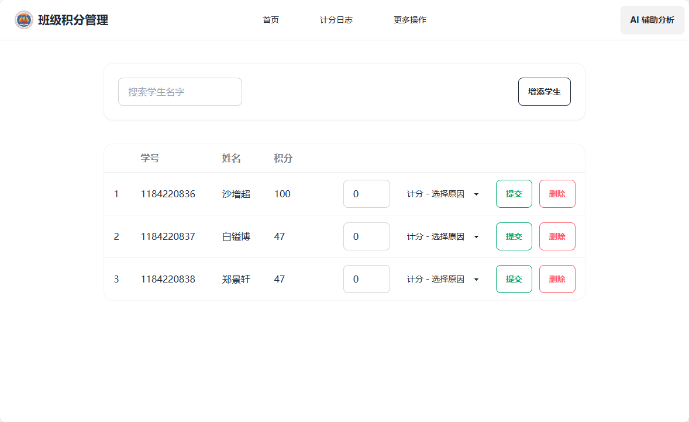

<h1 align="center">学生量化积分管理系统</h1>
 

 

**开发者：** 沙增超 、
**学校：** 平顶山市一中新区高级中学 、
**班级：** 高三（3）班

- **项目开源地址：** https://github.com/Lraiin/class_manager
- **项目演示地址：** http://7co.top:3737/ or http://39.106.60.68:3737/
- **项目说明：** 
1. 因为个人技术问题与时间问题，项目可能只适合（或并不适合所有）小型团体，班级类量化积分管理，项目没有细致编写与优化（如前端 数据的处理，换成 VUE/React 等框架可能会更好），可能并不适合实际需求使用。

2. 此项目为个人参加比赛的作品，也是我学习许长时间的第一个较为完善的作品，它也记录了我学习的过程与成果，它可能并不是很完美。

3. 登录的部分我没有使用身份验证，登录也没有加密，像会出现的一个小BUG，我没有给登录Cookie设置周期，让它在浏览器关闭后自动失效，但是服务在运行状态的时候，我们可以直接的进去，虽然不能获取到数据，但是没有被登录界面拦截，刷新一下就会跳转到登录，因为实力问题没有优化，仅在 index.html 后面做了刷新。

## 项目技术：
1. 后端使用了 Rust Actix-web 编写，数据库选用 SQLite。
2. 前端使用了 Alpinejs + DaisyUI 渲染处理数据。

## 项目优势：
1. 选用 Rust 语言，有较好的性能与内存安全，跨平台并且构建为二进制可执行文件，方便使用。
2. 前后端分离，由后端提供 API，方便前端开发者二次项目 WEB 界面，可自定义程度高。

## 项目部署：

<h3> Windows 平台部署 </h3>

在 Windows 平台部署较为简单，准备好 Windows 构建的压缩包，解压即可使用。

> **PS：** Windows 平台在运行服务后会自动执行 cmd 来打开浏览器启动 WEB

<h3> Linux 平台部署 </h3>

下面假设为你已下载并上传至服务器根目录的步骤。

1. 进入根目录，并解压压缩包：`cd / && mkdir app && tar -zxvf linux.tar.gz -C app`
2. 给予 `/app` 目录执行权限：`chmod -R 777 /app`
3. 启动服务：`/app/release/student`